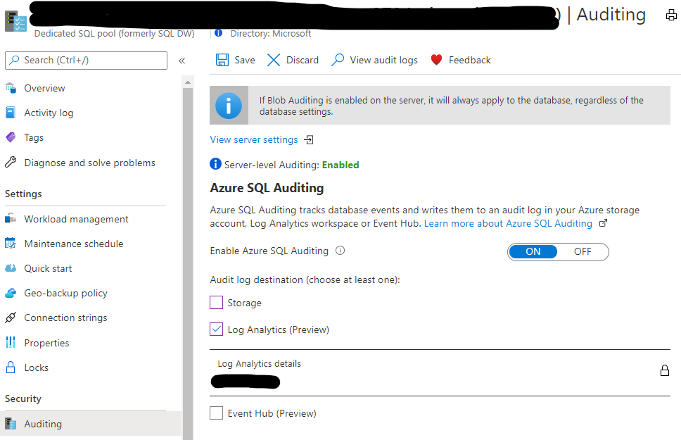
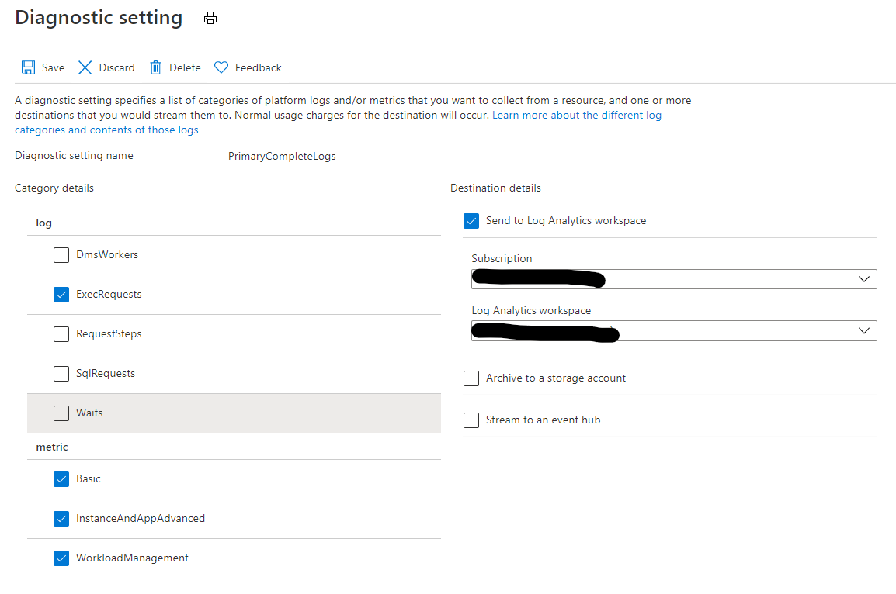

# Monitoring Synapse SQL Pools with Log Analytics

Synapse has powerful, simple to implement integration with Log Analytics.

## **Contents**
- [Why is this useful](#why-is-this-useful)
- [What can be logged](#what-can-be-logged)
- [How can this information be displayed](#how-can-this-information-be-displayed)
    - [Workbooks](./Workbooks/readme.md) (portal)
    - Logs viewer (portal) - [list of queries](./Queries/readme.md)
    - PowerBI
- [How is data captured to Log Analytics](#how-is-data-captured-to-log-analytics)

## Why is this useful

Data Management Views (DMVs) in Synapse are very useful in understanding workload, however many of the underlying datasets only retain the most recent 10k rows ([details](https://docs.microsoft.com/en-us/azure/synapse-analytics/sql-data-warehouse/sql-data-warehouse-service-capacity-limits#metadata)), which in busy systems means that current data will expire within hours or days. Log Analytics allows long term retention of this data and trend analysis.

## What can be logged

There are two kinds of logs: *audit* and *diagnostic logs*.

Audit logs include simplified views of workload on the platform and includes user names, source IPs and executed commands. Typically this will manifest as a single row per query.

Diagnostic logs include details of all the DMVs as well as metrics about the database. These closely mimic the DMVs. Queries stored in Log Analytics have some obfuscation applied, and are not currently linkable to a database principal. More detail [here](./Queries/diagnostics_notes.md).

- logs
    - DmsWorkers
    - ExecRequests
    - RequestSteps
    - SqlRequests
    - Waits
 - metric
    - Basic
    - InstanceAndAppAdvanced
    - WorkloadManagement

## How can this information be displayed

Users can use various methods to consume this information
- [Workbooks](./Workbooks/readme.md) (portal) 
- Logs viewer (portal) - [list of queries](./Queries/readme.md)
- PowerBI

## How is data captured to Log Analytics

For Audit logs (including username and summary query information)

For Diagnostic logs (including metric and detailed query information)

